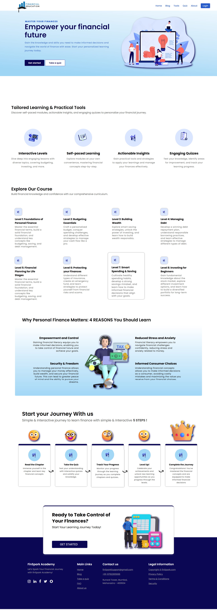

# 💸 Finwise – Financial Literacy Platform

> A web-based platform designed to help beginners learn about finance through interactive modules, quizzes, blogs, and calculators.



[](LICENSE)


---

## 🔗 Live Demo (Desktop Optimized)

🌐 [https://financial-literacy-platform.onrender.com/](https://financial-literacy-platform.onrender.com/)


---

## 💻  Tech Stack Used

* **Frontend:** HTML, CSS, JavaScript
* **Backend:** Django (Python)
* **Database:** PostgreSQL (hosted on Render)
* **Hosting:** Render

---

## 📌 Project Description

This Financial Literacy Platform aims to provide a comprehensive and interactive learning experience for beginners in finance, regardless of their age. It helps users enhance their understanding of financial concepts with quizzes, blogs, and calculators. The platform is designed to be engaging and educational, focusing on financial literacy in an easy-to-understand format.

---

## ✅ Why I Built It

The primary goal of this project was to create an accessible platform where users can learn the basics of finance and improve their financial literacy through interactive modules. By including content about finance with quizzes, financial calculators, and a personalized user dashboard, the platform serves as a comprehensive learning tool for people who are new to managing their finances.

---

## 🖼️ Screenshots

### 📸 Platform Screenshots

| Home                          | Dashboard                               |
| ----------------------------- | --------------------------------------- |
|  |  |

| Login                           | Signup                            |
| ------------------------------- | --------------------------------- |
|  |  |

| Learning Section                      | Assessment Quiz                                    |
| ------------------------------------- | -------------------------------------------------- |
|  |  |

| Calculators                                 | Blog Index                               |
| ------------------------------------------- | ---------------------------------------- |
|  |  |

---

## ⭐ Features

* **User Authentication:**                      
  Sign up, login, and track learning progress.
  
* **Blogs:**                                              
  Read informative blogs related to finance.
  
* **Finance Tools:**
  * **Savings Goal Calculator**
  * **Loan Repayment Calculator**
  * **Tax Saving Calculator**
  * **Budget Planner**
    
* **Modules and Chapters:**
  * 7 core modules, each with 5 chapters.
  * Each chapter includes 3 key concepts and a quiz.
    
* **Assessment Quiz:**                                 
For new users to assess their initial level of financial literacy.
  
* **User Dashboard:**                           
Track progress and see completed modules.

---

## 🛠 Installation/Usage Instructions

### Prerequisites

* Python 3.x
* Django
* PostgreSQL

### Steps to Set Up Locally

#### 1. Clone the repository:

```bash
git clone https://github.com/HawaleShalesh004/financial-literacy-platform.git
```

#### 2. Install dependencies:

```bash
   cd financial-literacy-platform
   pip install -r requirements.txt
```

#### 3. Create a .env file in the root directory with the following variables:

env

```
DATABASE_URL=<Your PostgreSQL URL>
SECRET_KEY=<Your Django Secret Key>
ALLOWED_HOSTS=<Your Allowed Hosts>
DEBUG=<True or False>
```

#### 4. Run migrations:

```
python manage.py migrate
```

#### 5. Load initial data from initial\_data.json:

```
python manage.py loaddata initial_data.json
```

#### 6. Start the development server:

```
python manage.py runserver
```

#### 7. Access the app at [http://127.0.0.1:8000/](http://127.0.0.1:8000/) in your browser.

---

## How to Use

* **Sign Up / Login:** Create an account or log in to access your personalized dashboard.
* **Take the Assessment Quiz:** Assess your current financial literacy level.
* **Explore Modules:** Start learning by exploring the core modules and chapters.
* **Use Calculators:** Use tools like the **Savings Goal Calculator** and **Loan Repayment Calculator** to practice real-life financial planning.
* **Track Progress:** Monitor your learning progress from the user dashboard.

---

## Data

The app uses an initial dataset provided in `initial_data.json`, which contains important data for the proper functioning of the application.
If you're using the app as a codebase, make sure to load this data after setting up the app using:

```bash
python manage.py loaddata initial_data.json
```

## 🚀 Future Improvements

* 🤖 Integrate **AI-driven personalized learning paths** based on user progress.
* 📚 Expand the **financial literacy content** and add more engaging quizzes.
* 🧮 Add more advanced **financial calculators and planning tools**.
* 📱 Improve **mobile responsiveness** and develop a **mobile app version** for wider accessibility.


---

## 📘 What I Learned

During the development of this project, I gained valuable experience in:

* 🔗 Integrating **Django with PostgreSQL** and deploying on **Render**.
* 🧠 Building **dynamic, user-interactive web applications** using Django.
* 🎯 Structuring **educational content and quizzes** to enhance learning and engagement.

---

## 🙋‍♂️ Author

**Shailesh Hawale**

- 📧 Email: [shaileshhawale004@gmail.com](mailto:shaileshhawale004@gmail.com)  
- 🐙 GitHub: [ShaileshHawale](https://github.com/HawaleShailesh004)
